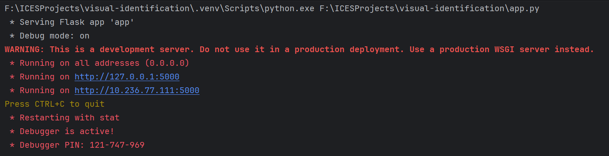

# Visual Identification 图片上传与管理服务

本项目是一个基于 Flask 框架构建的轻量级图片上传与图文数据管理后端服务。系统通过本地文件系统和 JSON 文件实现了图片资源与配套文本描述的同步存储、检索及访问功能。

## 项目概述

该服务主要解决轻量级场景下的图文数据上传与静态资源托管需求。系统为每次上传的图片自动分配 UUID，确保文件名的唯一性，并将图片文件、配套的文本说明文件以及包含原始信息的元数据进行分离存储与统一映射。

## 核心功能

* **图文同步上传**：支持接收上传的图片文件（限制为 png, jpg, jpeg, gif 格式）以及对应的文本描述。系统会自动将其分别保存，并建立关联。
* **元数据持久化**：使用 JSON 文件集中记录图片的原始文件名、生成的唯一标识、对应的文本文件名以及上传时间戳，替代繁重的关系型数据库。
* **资源访问支持**：提供独立的静态资源访问路由，可以直接通过 URL 访问具体的图片或文本内容。
* **数据列表检索**：支持获取所有上传数据的概览列表或单张图片的详情，并且在查询列表时内置了简单的脏数据校验（自动剔除已物理丢失的图片元数据）。
* **一键重置**：提供全局清理接口，可一键清空所有的物理文件（图片与文本）并重置元数据记录。

## 接口概览

以下为系统对外暴露的核心路由端点：

* **POST /upload**：接收表单数据进行上传。必需字段为图片文件，可选字段为文本描述。返回上传状态、生成的文件名及访问链接。
* **GET /images**：获取当前系统中所有存活图片的列表及详细元数据。
* **GET /image/[文件名]**：查询指定单张图片的元数据信息。
* **GET /images/[文件名]**：直接访问或下载具体的图片物理文件。
* **GET /texts/[文件名]**：直接访问或下载具体的文本描述物理文件。
* **GET /clear_all**：危险操作，清空所有存储的图片、文本文件及元数据记录。

## 存储目录结构说明

系统在运行时会自动依赖并维护以下结构：

* **images 目录**：用于集中存放所有经过重命名（UUID 前缀）的安全图片文件。
* **texts 目录**：用于集中存放与图片对应的 `.txt` 格式的文本描述文件。
* **image_metadata.json 文件**：位于根目录，作为轻量级数据库使用，负责维护文件映射关系与业务信息。

## 项目运行截图

